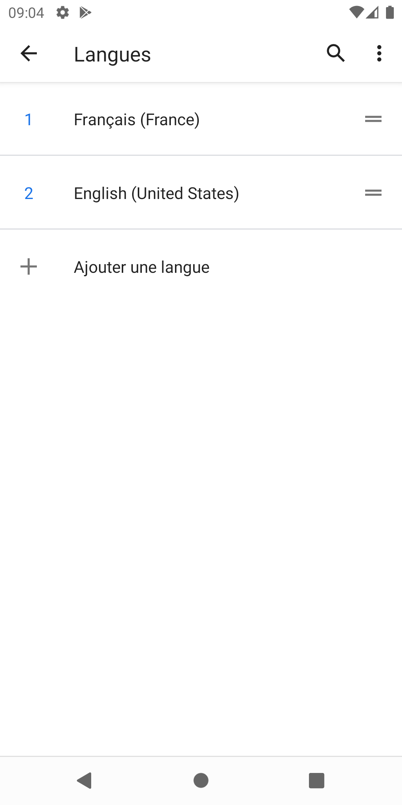

# Assignment05 Color Changing App With French

Instructions: Extend your previous application by adding localization with a French translation for any region. You will first update the application you worked on in the last lab to ensure that text labels and all string literals are replaced with strings from a resource file. You will then provide a translation for a second language.

# Application Function

The Color Changing App with French looks identical to Color Changing App but with French and American flag on it.

Click on the application icon and enter the app, the user will see the layout of the app. It prompts the user to choose the color from the gridView. Once the user click on the item, the application will start up a new activity and show the color with name.

If the user change the language setting of the pixel to French, the application will set the strings into French as well. 

Here is the result of changing the language into French.

